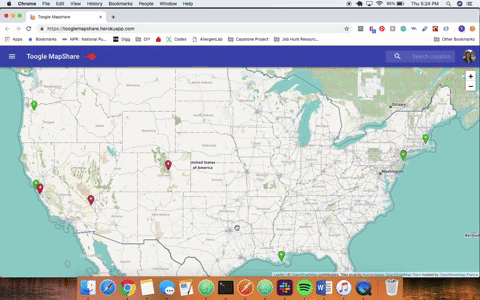
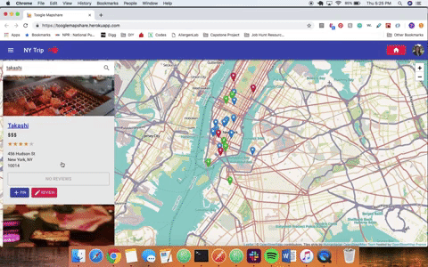
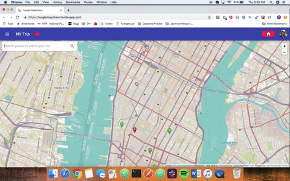

# README

[ToogleMapshare](https://tooglemapshare.herokuapp.com/) is a single page web application clone of Google Maps with an added social functionality. It is an interactive mapping tool allowing the user to create lists with pins of their favorite places. Users can also see pins and reviews from their friends. 

### Technologies
ToogleMapshare was created with a Ruby on Rails backend with a PostgresSQL database and a React/Redux frontend. Additional frameworks and libraries used include:

* [Leaflet](https://leafletjs.com/) - for mobile-friendly, interactive maps
* [Material UI](https://material-ui.com/) - for the design pattern of the application

### Key Features

A full demo video can be found [here](https://vimeo.com/326194696/e5d3488daa).

#### Interactive Map

User can search specific locations on a map to see the pins in the area. Based on the area searched, the map will zoom in accordingly and display pins at that location. Users can then hover over each pin to view the place or click on the pin for further details of who has pinned the place and any reviews left by friends. 

The map zoom feature is handled by hitting the googlemaps API to find the longitude and latitude of the keyword location entered. This information is then taken to adjust the view area and zoom on the map. 

#### List/Pin/Review CRD and Search Functionality

User can create a new list for a specific location or view current lists in their repository. Once a new list is created, the map will zoom in on the specific location and showcase all pins by other users at that location. User can choose to pin a location already previously pinned or search additional places to pin. 

The search functionality uses the Yelp Fusion API to display the top 15 results based on the keyword entered. These results will display on the page in blue pins. Each result provides location details as well as the link to it's Yelp page. Clicking on the result card will then hide other pins and zoom in that location. Users can choose to pin the result or add a review. 

#### Toggle tool 

User can choose to hide pins from other users to only display pins that they've created or those that are associated with their list. 

### Future Direction

The major focus of this application was dedicated to design and basic functionality. If provided more time, additional features would include:

* user sign-up/login
* profile pages of other users and the lists they've generated
* editing reviews

